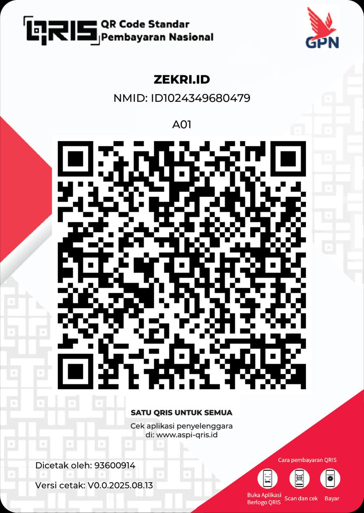

# Votol BLE+WiFi Dashboard

[](https://zekri.id)
[](https://www.espressif.com/)
[](LICENSE)

Real-time monitoring dashboard for **Votol Controller** and **BMS (Battery Management System)** via CAN bus. Built with **ESP32** and a **Single-Binary Go Application**.

> **NEW**: Now powered by Go! No Python installation required. Just download and run.

---

## ⚠️ DISCLAIMER / PERINGATAN

> **ENGLISH:**  
> This project is provided "AS IS" without any warranty. Use at your own risk.  
> The author (**Zekri R / ZEKRI.ID**) is **NOT responsible** for any damage, malfunction, or injury that may occur to your vehicle, controller, battery, or any other components.  
> Modifying or monitoring your electric vehicle's CAN bus may void your warranty and could be dangerous if done incorrectly.

> **BAHASA INDONESIA:**  
> Proyek ini disediakan "APA ADANYA" tanpa jaminan apapun. Gunakan dengan risiko Anda sendiri.  
> Penulis (**Zekri R / ZEKRI.ID**) **TIDAK bertanggung jawab** atas kerusakan, malfungsi, atau cedera yang mungkin terjadi pada kendaraan, controller, baterai, atau komponen lainnya.  
> Memodifikasi atau memonitor CAN bus kendaraan listrik Anda dapat membatalkan garansi dan berbahaya jika dilakukan secara tidak benar.

---

## 🎁 Donasi / Support

Jika project ini bermanfaat bagi Anda, Anda bisa mendukung pengembangan selanjutnya dengan berdonasi melalui QRIS berikut:

<p align="center">
  
</p>

Terima kasih atas dukungan Anda! 🙏

---

## 📋 Deskripsi Project

Sistem monitoring real-time untuk kendaraan listrik dengan **Votol Controller** dan **BMS** berbasis CAN bus. Data dikirim via Bluetooth Low Energy (BLE) atau WiFi ke dashboard.

### Data yang Dimonitor

| Kategori | Data |
|----------|------|
| **Votol Controller** | RPM, Speed, Mode (PARK/DRIVE/SPORT/BRAKE/REVERSE/CHARGING), Controller Temp, Motor Temp |
| **BMS General** | Pack Voltage, Current, Power, SOC (State of Charge), SOH (State of Health), Cycle Count |
| **BMS Capacity** | Remaining Capacity (Ah), Full Charge Capacity (Ah) |
| **Cell Voltages** | 23 individual cell voltages (mV), Cell Delta, Highest/Lowest/Average Cell |
| **Temperatures** | 5 cell temperature sensors, Max/Min Temperature with cell number |
| **Balance Status** | Balance Mode, Balance Status, Individual cell balancing bitmask |
| **Charging Info** | Charger Connected Status, Charging Voltage/Current, **Original Charger Detection** |
| **Device Info** | BMS Hardware Version, BMS Firmware Version |

---

## 📥 Download & Jalankan (Cara Mudah)

Anda tidak perlu menginstall Python atau dependency apapun. Cukup download binary yang sudah di-compile dari halaman **Releases**.

### 1. Download Aplikasi
Kunjungi halaman **[Releases](../../releases)** dan download file sesuai sistem operasi Anda:

- **Windows**: `votol-dashboard-windows-amd64.exe`
- **Linux**: `votol-dashboard-linux-amd64` (PC) atau `votol-dashboard-linux-arm64` (Raspberry Pi)
- **macOS**: `votol-dashboard-darwin-amd64` (Intel) atau `votol-dashboard-darwin-arm64` (Apple Silicon)
- **Firmware ESP32**: `firmware.bin`

### 2. Jalankan Aplikasi
**Windows**: 
Double-click `votol-dashboard-windows-amd64.exe`. Browser akan otomatis terbuka.

**Linux / macOS**:
Buka terminal dan jalankan:
```bash
chmod +x votol-dashboard-linux-amd64  # Beri izin eksekusi
./votol-dashboard-linux-amd64
```

Web dashboard akan terbuka di browser secara otomatis.

> **Catatan**: Aplikasi ini akan otomatis mendeteksi ESP32 via USB Serial, BLE, atau WiFi Sniffer.

---

## 🔧 Setup Hardware (ESP32)

### 1. Wiring Diagram
Hubungkan ESP32 dengan CAN Transceiver (SN65HVD230 recommended):

```
┌─────────────────┐              ┌──────────────────┐
│     ESP32       │              │  CAN Transceiver │
│                 │              │   (SN65HVD230)   │
│  GPIO21 (TX) ───┼──────────────┼─── CTX           │
│  GPIO22 (RX) ───┼──────────────┼─── CRX           │
│  3.3V ──────────┼──────────────┼─── VCC           │
│  GND ───────────┼──────────────┼─── GND           │
└─────────────────┘              │                  │
                                 │  CANH ───────────┼──→ CAN High (Votol/BMS)
                                 │  CANL ───────────┼──→ CAN Low (Votol/BMS)
                                 └──────────────────┘
```

### 2. Flash Firmware
1. Download `firmware.bin` dari halaman **Releases**.
2. Gunakan [ESP Web Tools](https://espressif.github.io/esptool-js/) atau `esptool.py` untuk flash ke ESP32.
   ```bash
   esptool.py --chip esp32 --port /dev/ttyUSB0 write_flash 0x10000 firmware.bin
   ```
   
> **Note**: Firmware ini support Dual-Core (Core 0 CAN, Core 1 BLE/WiFi) untuk performa maksimal.

---

## 🎯 Features

### ✅ Real-time Monitoring
- Speed, RPM, Mode (PARK/DRIVE/SPORT/BRAKE/REVERSE)
- Pack Voltage, Current, Power
- SOC (%), SOH (%), Cycle Count
- Controller, Motor, Battery Temperatures

### ✅ Charging System Detection (NEW)
- Detects when Charger is Connected
- Identifies **Original Charger** vs Generic
- Monitors Charging Voltage and Current
- Special "CHARGING" mode indication

### ✅ BMS Cell Inspector
- 23 individual cell voltages
- Cell delta (mV) - difference between highest and lowest
- Highest/Lowest/Average cell statistics
- Color-coded alerts for imbalanced cells

### ✅ Dual Transport Mode
- **BLE Mode (Default)**: Auto-connect, stable, low power, ~10m range
- **WiFi Mode**: Longer range (~50m), higher throughput, auto-return to BLE
- **USB Serial (Fallback)**: Direct connection for debugging

---

## 🌐 WiFi Mode

ESP32 support WiFi AP mode sebagai alternatif dari BLE:

### Cara Switch ke WiFi Mode
Dari Flutter app (via BLE), kirim command: `WIFI:ON`

ESP32 akan:
1. Stop BLE dan matikan advertising
2. Start WiFi AP dengan SSID: `VOTOL_Dashboard`
3. Start WebSocket server di port 81 (Password: `votol1234`, IP: `192.168.4.1`)

---

## 📊 JSON Data Format

Aplikasi Go ini otomatis mengkonversi format JSON ringkas (diciptakan untuk efisiensi ESP32) menjadi format lengkap untuk Web Dashboard.

**Input (Raw from ESP32):** `{"v":72.5, "a":10.0, "r": 1500 ...}`

**Output (Processed by Go App):**
```json
{
  "volts": 72.5,
  "amps": 10.0,
  "rpm": 1500,
  "mode": "SPORT",
  "temps": {"ctrl": 45, "motor": 50, "batt": 35},
  ...
}
```

> 📖 **Dokumentasi Protokol Lengkap**: [docs/BLE_WIFI_PROTOCOL.md](docs/BLE_WIFI_PROTOCOL.md)

---

## 📱 Android App (Alternative)

Selain menggunakan Web Dashboard di PC, Anda juga bisa menggunakan aplikasi Android:
**[Download PEV App Release](https://github.com/zexry619/pev-app-release)**

---

## 💻 Build from Source (Advanced)

Jika Anda ingin memodifikasi kode Go atau Firmware:

### Go Dashboard
```bash
cd go_web
go build -o votol-dashboard .
```

### ESP32 Firmware
Gunakan Arduino IDE dengan `esp32:esp32` core. Buka `esp32/votol_ble_dualcore/votol_ble_dualcore.ino`.

---

## 🔧 Troubleshooting

### ESP32 tidak terdeteksi
- Pastikan driver USB UART sudah terinstall (CP210x atau CH340).
- Cek kabel data USB (bukan kabel charge only).

### Data tidak muncul di Dashboard
- **Serial**: Pastikan tidak ada aplikasi lain yang menggunakan port COM/ttyUSB.
- **BLE**: Pastikan PC Anda support Bluetooth 4.0+.
- **Wiring**: Cek kembali wiring CAN bus (High/Low jangan terbalik).

### CAN Baud Rate
- Default: **250kbps**. Pastikan Votol disetting ke 250kbps jika tidak muncul data.

---

## 📝 License
MIT License

*Copyright (c) 2026 Zekri R*
